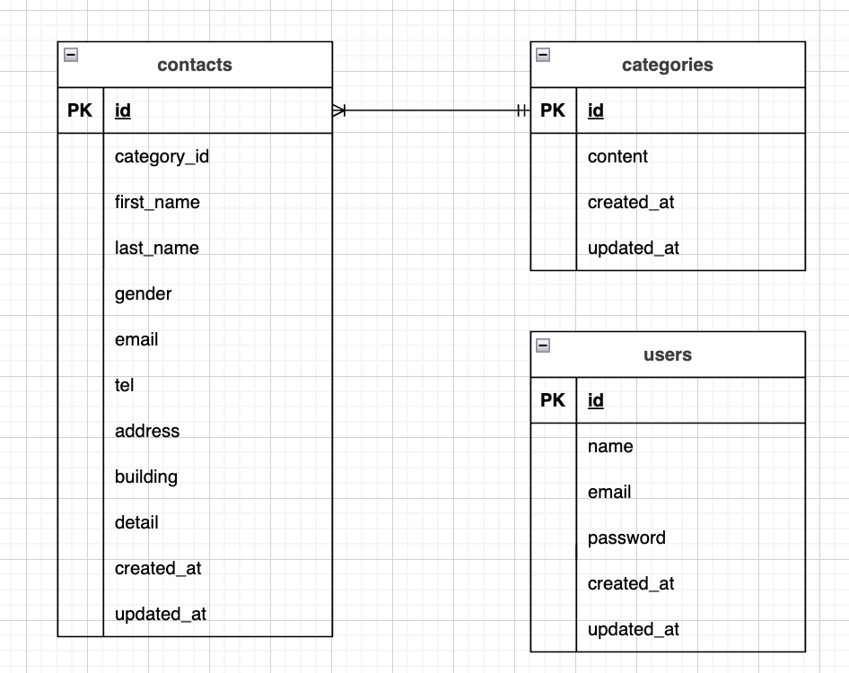

# アプリケーション名
お問い合わせフォーム

## 環境構築
### Dockerビルド

1. `git clone https://github.com/stao42/contact-form.git`
2. `cd contact-form`
3. `docker compose up -d --build`

* MySQLは、OSによって起動しない場合があるのでそれぞれのPCに合わせて `docker-compose.yml` ファイルを編集してください。

### Laravel環境構築

1. `docker compose exec php bash`
2. `composer install`
3. `.env.example`ファイルから`.env`を作成し、以下の環境変数を設定：
   - `DB_HOST=mysql`
   - `DB_DATABASE=laravel_db`
   - `DB_USERNAME=laravel_user`
   - `DB_PASSWORD=laravel_pass`
4. `php artisan key:generate`
5. `php artisan migrate`
6. `php artisan db:seed`

## 使用技術(実行環境)

- PHP 8.2
- Laravel 10.0
- MySQL 8.0

## ER図

### テーブル説明

#### users（ユーザーテーブル）
- ログイン・登録機能で使用
- 管理者アカウントの管理

#### categories（カテゴリテーブル）
- お問い合わせの種類を管理
- 例：一般的なお問い合わせ、サポート、ビジネス、その他

#### contacts（お問い合わせテーブル）
- お問い合わせフォームのデータを保存
- `gender`フィールド：1=男性、2=女性、3=その他
- `category_id`でcategoriesテーブルと関連

## URL

- **開発環境**: http://localhost/
- **phpMyAdmin**: http://localhost:8080/

## 機能

### お問い合わせフォーム
- 氏名（姓・名）
- 性別（男性・女性・その他）
- メールアドレス
- 電話番号
- 住所
- 建物名（任意）
- お問い合わせの種類
- お問い合わせ内容

### 確認画面
- 入力内容の確認
- 修正機能
- 送信機能

### 完了画面
- 送信完了メッセージ
- ホームボタン

### 認証機能
- ログイン画面
- 登録画面

## デザイン

- レスポンシブデザイン対応
- モダンでミニマルなUI
- 統一されたカラーパレット（#8B7969, #F1ECE7等）
